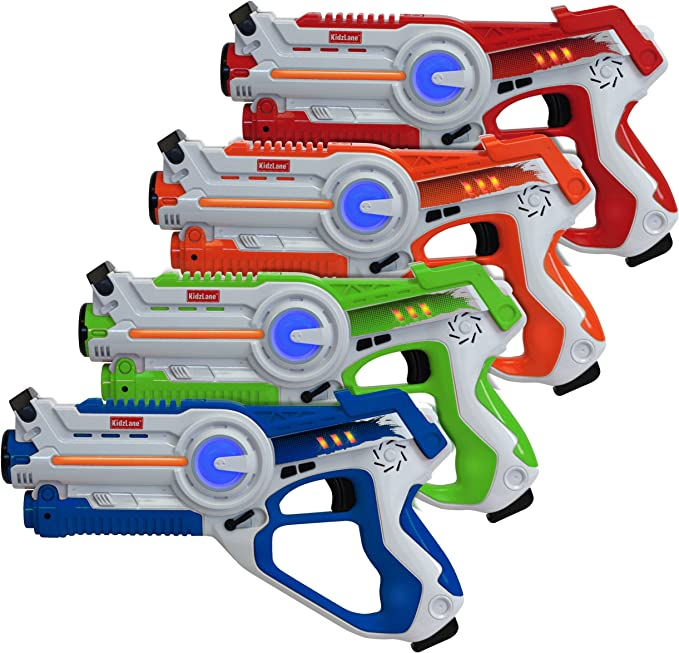

## Flipper Laser Tag

1) The ".ir" files go in the infrared folder on the Flipper.

2) Navigate to Infrared -> Saved Remotes -> Select YOUR color.

3) Choose one of the weapons: Pistol, Shotgun, Assault, Bazooka. Holding down the Bazooka button will cause your opponent to lose immediately. 😏

The laser tag set I used is not sold on Amazon anymore. However, there appear to be look-alikes that probably use the same signals.

If they look like [this](https://amzn.to/3WrO8bt), chances are, they will work:

